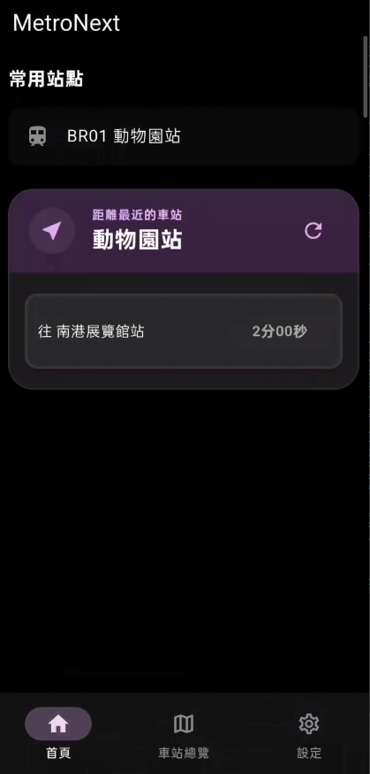
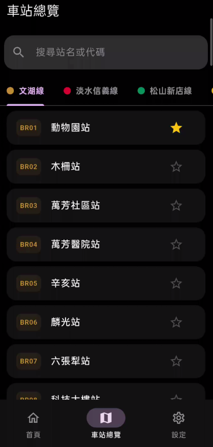

<div align="center">
  
  <h1>MetroNext Taipei</h1>
</div>

<div align="center">
  <p>A minimalist, cross-platform companion app for the Taipei Metro (TRTC) system.</p>
</div>

[正體中文 (Traditional Chinese)](README.zh-TW.md)

## 📸 Screenshots

| Screenshot 1 | Screenshot 2 |
| :---: | :---: |
|  |  |
| *Home & Nearest Station* | *Stations Search* |

## Features

* 🚇 **Real-Time Countdown:** Get live countdowns for the next and following trains on all metro lines.
* 📍 **Nearest Station Finder:** Instantly locate the closest metro station to you.
* 🗺️ **Station Details & Facilities:** Access entrance/exit locations, elevators, escalators, and station amenities.
* 🌓 **Clean Design & Themes:** A minimalist Material 3 interface with beautiful light and dark mode choices.
* 🌐 **Bilingual Support:** Smoothly switch between Chinese and English.

## Project Architecture

The codebase follows a clean, consistent modular structure:
* `lib/models/`: Encapsulates data models (e.g. `train_model.dart`).
* `lib/screens/`: Views and screens (e.g. `dashboard_screen.dart`, `stations_overview_screen.dart`, `settings_screen.dart`, `station_detail_screen.dart`).
* `lib/services/`: Services and logic handlers (e.g. `database_service.dart`, `api_service.dart`, `location_service.dart`, `locale_service.dart`, `theme_service.dart`).
* `lib/widgets/`: Reusable UI widgets (e.g. `train_card.dart`, `nearest_station_card.dart`).

## Supported Platforms

* Android
* Web

## Download

You can download the latest Android APK from the [releases page](https://github.com/wyrindev/metro-next-taipei/releases).

## Translation

You can help translate MetroNext Taipei into your language via [Weblate](https://weblate.wyrin.dev/projects/metro-next-taipei).

## Getting Started

### Prerequisites

* [Flutter SDK](https://flutter.dev/docs/get-started/install)

### Installation

1. Clone the repository:
   ```sh
   git clone https://github.com/wyrindev/metro-next-taipei.git
   ```
2. Navigate to the project directory:
   ```sh
   cd metro-next-taipei
   ```
3. Install dependencies:
   ```sh
   flutter pub get
   ```

### Running the Application

* Run the app:
  ```sh
  flutter run
  ```

## Building for Production

### Android

* Build an APK:
  ```sh
  flutter build apk
  ```

### Web

* Build the web application:
  ```sh
  flutter build web
  ```
The output will be in the `build/web` directory.