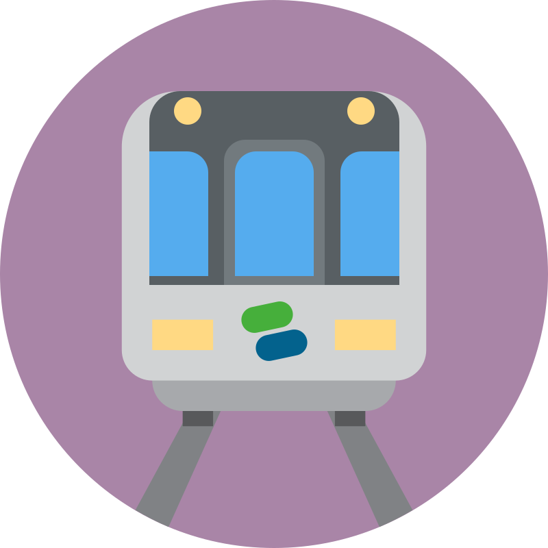
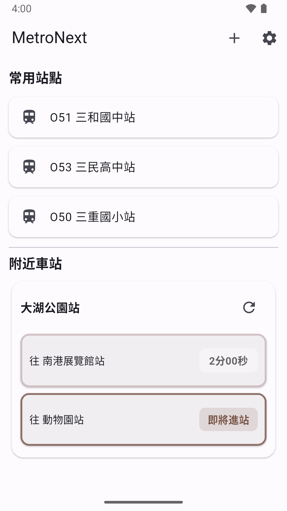
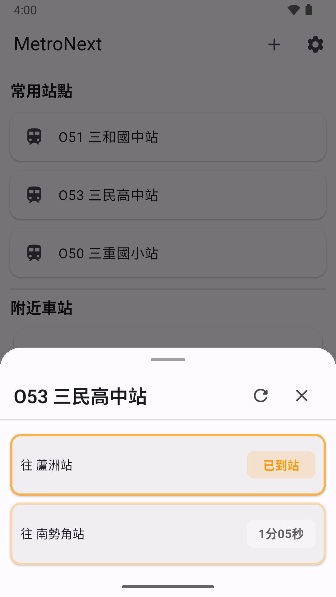

<div align="center">
  
  <h1>MetroNext Taipei</h1>
</div>

<div align="center">
  <p>一個極簡、跨平台的台北捷運隨身小幫手。</p>
</div>

[English](README.md)

## 📸 螢幕截圖

| 螢幕截圖 1 | 螢幕截圖 2 |
| :---: | :---: |
|  |  |
| *App 螢幕截圖 1* | *App 螢幕截圖 2* |

## 功能

*   **即時列車倒數：** 獲取所有捷運路線的即時到站與發車資訊。
*   **最近車站查找：** 使用您裝置的定位，快速找到離您最近的捷運站。

## 待辦事項 (TODO)

*   **完整車站詳情：** 查看每個車站的詳細資訊，包括：
    *   車站配置與地圖。
    *   出入口位置。
    *   提供設施，如電梯、手扶梯、洗手間、ATM 和充電站。
*   **多語言支援：** 持續完善英文與其他語言的在地化支援。

## 支援平台

*   Android
*   Web

## 下載

您可以從 [發佈頁面 (releases page)](https://github.com/wyrindev/metro-next-taipei/releases) 下載最新的 Android APK。

## 開始使用

### 先決條件

*   [Flutter SDK](https://flutter.dev/docs/get-started/install)

### 安裝

1.  克隆儲存庫：
    ```sh
    git clone https://github.com/wyrindev/metro-next-taipei.git
    ```
2.  進入專案目錄：
    ```sh
    cd metro-next-taipei
    ```
3.  安裝依賴項目：
    ```sh
    flutter pub get
    ```

### 執行應用程式

*   在您連接的裝置或模擬器上執行應用程式：
    ```sh
    flutter run
    ```

## 建置生產版本

### Android

*   建置 APK：
    ```sh
    flutter build apk
    ```
*   建置 App Bundle：
    ```sh
    flutter build appbundle
    ```

### Web

*   建置 Web 應用程式：
    ```sh
    flutter build web
    ```
建置結果將位於 `build/web` 目錄中。
