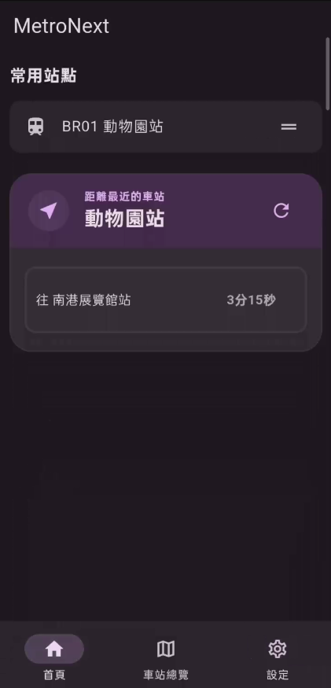
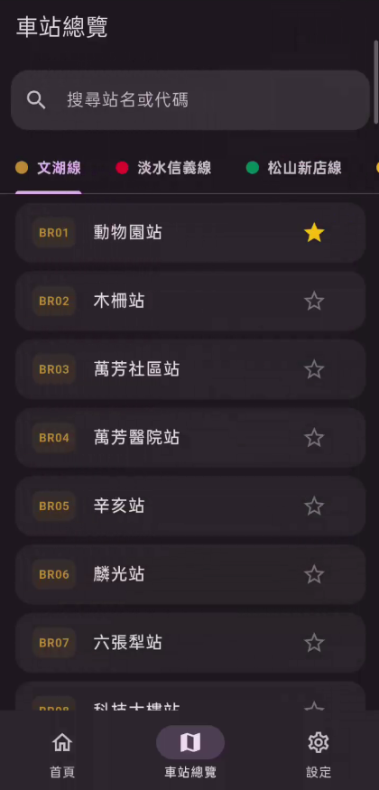

<div align="center">
  
  <h1>MetroNext Taipei</h1>
</div>

<div align="center">
  <p>一個極簡、跨平台的台北捷運隨身小幫手。</p>
</div>

[English Version](README.md)

## 📸 螢幕截圖

| 螢幕截圖 1 | 螢幕截圖 2 |
| :---: | :---: |
|  |  |
| *首頁與最近車站* | *車站總覽與搜尋* |

## 功能特點

* 🚇 **即時列車倒數：** 獲取所有捷運路線的即時到站與發車倒數資訊。
* 📍 **最近車站查找：** 使用定位快速找到離您最近的捷運站。
* 🌓 **簡潔設計與主題：** 極簡的 Material 3 介面，並支援舒適的淺色與深色主題。

## 專案架構

本專案採用清晰的模組化結構：
* `lib/models/`：數據模型（如 `train_model.dart`）。
* `lib/screens/`：視圖與畫面（如 `dashboard_screen.dart`、`stations_overview_screen.dart`、`settings_screen.dart`、`station_detail_screen.dart`）。
* `lib/services/`：服務與邏輯處理（如 `database_service.dart` , `api_service.dart` , `location_service.dart` , `locale_service.dart` , `theme_service.dart`）。
* `lib/widgets/`：可複用的 UI 組件（如 `train_card.dart`、`nearest_station_card.dart`）。

## 支援平台

* Android
* Web

## 下載

您可以從 [發佈頁面](https://github.com/wyrindev/metro-next-taipei/releases) 下載最新的 Android APK。

## 翻譯 / 在地化

您可以透過 [Weblate](https://weblate.wyrin.dev/projects/metro-next-taipei) 協助我們將 MetroNext Taipei 翻譯成更多語言。

## 開始使用

### 先決條件

* [Flutter SDK](https://flutter.dev/docs/get-started/install)

### 安裝

1. 克隆儲存庫：
   ```sh
   git clone https://github.com/wyrindev/metro-next-taipei.git
   ```
2. 進入專案目錄：
   ```sh
   cd metro-next-taipei
   ```
3. 安裝依賴項目：
   ```sh
   flutter pub get
   ```

### 執行應用程式

* 執行應用程式：
  ```sh
  flutter run
  ```

## 建置生產版本

### Android

* 建置 APK：
  ```sh
  flutter build apk
  ```

### Web

* 建置 Web 應用程式：
  ```sh
  flutter build web
  ```
建置結果將位於 `build/web` 目錄中。
